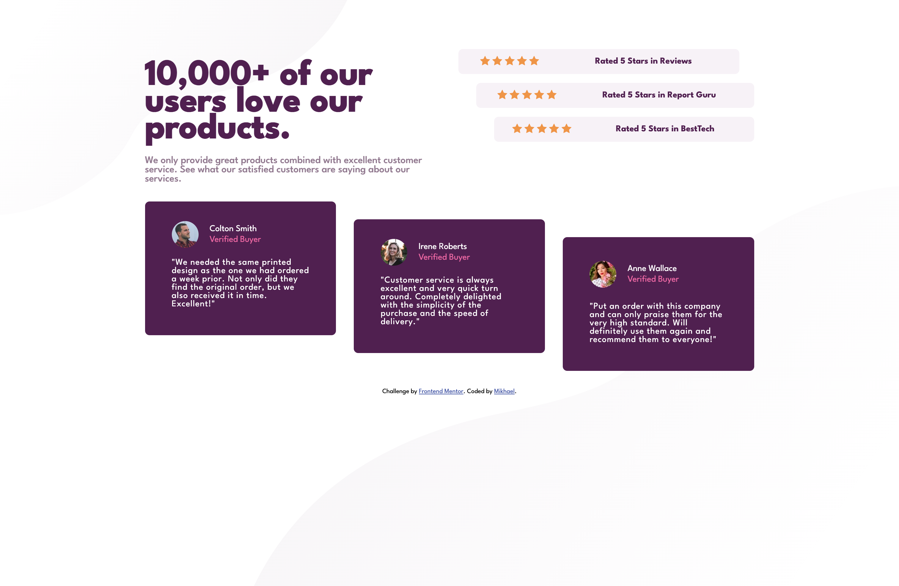

# Frontend Mentor - 3-column preview card component solution

This is a solution to the [3-column preview card component challenge on Frontend Mentor](https://www.frontendmentor.io/challenges/3column-preview-card-component-pH92eAR2-). Frontend Mentor challenges help you improve your coding skills by building realistic projects.

## Table of contents

- [Overview](#overview)
  - [The challenge](#the-challenge)
  - [Screenshot](#screenshot)
  - [Links](#links)
- [My process](#my-process)
  - [Built with](#built-with)
  - [What I learned](#what-i-learned)
  - [Continued development](#continued-development)
  - [Useful resources](#useful-resources)
- [Author](#author)
- [Acknowledgments](#acknowledgments)

## Overview

### The challenge

Users should be able to:

- View the optimal layout depending on their device's screen size
- See hover states for interactive elements

### Screenshot



Add a screenshot of your solution. The easiest way to do this is to use Firefox to view your project, right-click the page and select "Take a Screenshot". You can choose either a full-height screenshot or a cropped one based on how long the page is. If it's very long, it might be best to crop it.

Alternatively, you can use a tool like [FireShot](https://getfireshot.com/) to take the screenshot. FireShot has a free option, so you don't need to purchase it.

Then crop/optimize/edit your image however you like, add it to your project, and update the file path in the image above.

### Links

- Solution URL: [Solution URL here](https://www.frontendmentor.io/solutions/3column-preview-card-component-CTLc0OvEbJ)
- Live Site URL: [Live site URL here](https://3-column-preview-card-component-mikhael7.vercel.app/)

## My process

### Built with

- Semantic HTML5 markup
- CSS custom properties
- Flexbox
- CSS Grid
- Mobile-first workflow

### What I learned

I learned how to layouting using display flex from the mobile view to desktop view, the project before [stats preview component](https://www.frontendmentor.io/solutions/stats-preview-card-component-d7ZkT4W2BQ), was using this similar approach to swap position with image, but instead using row or column, it used row-reverse to swap the order of the component.

CSS display flex for mobile view :

```css
main > section > div.card-container {
  display: flex;
  flex-direction: column;
  max-width: calc(32.5rem / 2);
}
```

CSS display flex for desktop view :

```css
main > section > div.card-container {
  flex-direction: row;
  justify-content: center;
}
```

If you want more help with writing markdown, we'd recommend checking out [The Markdown Guide](https://www.markdownguide.org/) to learn more.

### Continued development

I will learn more and using more flex and grid in the future projects or even both, depending on the situation.

### Useful resources

- [MDN - Font Variations](https://developer.mozilla.org/en-US/docs/Web/CSS/font-variation-settings) - This helped me for importing font variation, i will used it forwards and if the font support font-variation.
- [W3 School - Custom Button](https://www.w3schools.com/csS/tryit.asp?filename=trycss_buttons_basic) - This is the custom button by W3 School as reference.

## Author

- Frontend Mentor - [@mikhael7](https://www.frontendmentor.io/profile/@mikhael7)
- Github - [@mikhael7](https://github.com/mikhael7)

## Acknowledgments

This is where you can give a hat tip to anyone who helped you out on this project. Perhaps you worked in a team or got some inspiration from someone else's solution. This is the perfect place to give them some credit.

[vacamares](https://www.frontendmentor.io/profile/vcarames) - Thank you for your comments for tips and suggestions. 👏
